# Architecture Overview

Everything runs on a single Proxmox VE host (192.168.1.253) with four virtual bridges, each carrying a separate network. Shared services bridge across networks where needed.

## Network Diagram

```mermaid
graph TB
    subgraph Internet
        INET((Internet))
        PLAYERS((Game Clients))
    end

    subgraph PVE["Proxmox Host (192.168.1.253)"]
        subgraph VMBR0["vmbr0 -- Home LAN (192.168.0.0/23)"]
            ROUTER["Router<br/>192.168.1.1"]
            VPN["vpn-gateway<br/>192.168.1.104"]
            BT["bittorrent<br/>192.168.1.116"]
            NGINX["nginx-proxy<br/>192.168.1.118<br/>tri-homed"]
            PWEB["personal-web<br/>192.168.1.117"]
        end

        subgraph VMBR1["vmbr1 -- WOL Prod (10.0.0.0/24)"]
            GWAB["wol-gateway-a/b<br/>10.0.0.200 / 10.0.0.201<br/>NAT, DNS, NTP"]
            WOLHOSTS["prod + shared hosts<br/>(infra, APIs, DBs,<br/>game engine, obs)"]
            WOLA["wol-a<br/>:6969 external"]
            WOLWEB["wol-web<br/>:5000 (Kestrel)"]
        end

        subgraph VMBR3["vmbr3 -- WOL Test (10.0.1.0/24)"]
            TESTHOSTS["test hosts<br/>(realm, world, AI, DBs)"]
        end

        subgraph VMBR2["vmbr2 -- ACK Private (10.1.0.0/24)"]
            ACKGW["ack-gateway<br/>10.1.0.240 / 192.168.1.240<br/>NAT, DNS, port fwd"]
            ACKDB["ack-db<br/>10.1.0.246<br/>:5432 (PostgreSQL)"]
            MUDS["5 MUD servers<br/>10.1.0.241-245"]
            ACKWEB["ack-web<br/>10.1.0.247<br/>:5000 (Kestrel)"]
            TNGAI["tng-ai<br/>10.1.0.248<br/>:8000 (NPC dialogue)"]
            TNGDB["tngdb<br/>10.1.0.249<br/>:8000 (game content API)"]
        end

        CACHE["apt-cache (quad-homed)<br/>192.168.1.115 (vmbr0)<br/>10.0.0.115 (vmbr1)<br/>10.0.1.115 (vmbr3)<br/>10.1.0.115 (vmbr2)<br/>apt-cacher-ng :3142"]
    end

    INET --- ROUTER
    ROUTER --- VPN
    VPN -->|"VPN tunnel"| INET
    BT -->|"all traffic"| VPN

    ROUTER --- GWAB
    GWAB -->|"NAT"| INET
    PLAYERS -->|":6969"| WOLA
    PLAYERS -->|":80/:443"| NGINX
    NGINX -->|"proxy"| WOLWEB
    NGINX -->|"proxy"| ACKWEB
    NGINX -->|"proxy"| PWEB
    PLAYERS -->|":8890-8894"| ACKGW
    ACKGW -->|"DNAT"| MUDS
    MUDS -->|"PostgreSQL"| ACKDB
    TNGDB -->|"PostgreSQL"| ACKDB

    GWAB ---|"dual-homed"| TESTHOSTS
    CACHE ---|"vmbr0"| ROUTER
    CACHE ---|"vmbr1"| WOLHOSTS
    CACHE ---|"vmbr3"| TESTHOSTS
    CACHE ---|"vmbr2"| MUDS

    style CACHE fill:#9f9,stroke:#333,color:#000
    style GWAB fill:#4a9,stroke:#333,color:#000
    style ACKGW fill:#4a9,stroke:#333,color:#000
    style VPN fill:#4a9,stroke:#333,color:#000
    style WOLA fill:#f66,stroke:#333,color:#000
    style WOLWEB fill:#f96,stroke:#333,color:#000
    style MUDS fill:#f66,stroke:#333,color:#000
    style ACKDB fill:#96f,stroke:#333,color:#000
    style BT fill:#69f,stroke:#333,color:#000
    style WOLHOSTS fill:#69f,stroke:#333,color:#000
    style TESTHOSTS fill:#69f,stroke:#333,color:#000
    style NGINX fill:#f96,stroke:#333,color:#000
    style PWEB fill:#f96,stroke:#333,color:#000
    style ACKWEB fill:#f96,stroke:#333,color:#000
    style TNGAI fill:#fc6,stroke:#333,color:#000
    style TNGDB fill:#fc6,stroke:#333,color:#000
```

## Bridges

| Bridge | Subnet | Purpose |
|--------|--------|---------|
| `vmbr0` | 192.168.0.0/23 | Home LAN. Router at 192.168.1.1. Operator access, external-facing services, internet egress. |
| `vmbr1` | 10.0.0.0/24 | WOL prod + shared infrastructure. Dual gateways provide NAT, DNS, NTP. |
| `vmbr2` | 10.1.0.0/24 | ACK private network. Legacy MUD servers. Own gateway with port forwarding. |
| `vmbr3` | 10.0.1.0/24 | WOL test environment. Isolated from prod. Gateways provide NAT but do not route between vmbr1 and vmbr3. |

No traffic flows directly between bridges. Shared hosts are dual-homed (on both vmbr1 and vmbr3) or tri/quad-homed to provide services across networks. Gateways provide NAT for both prod and test subnets but do not route between them.

## WOL (vmbr1 + vmbr3)

The World of Legends game infrastructure. 19 guests (18 LXC + 1 VM) across two bridges. Two active-active gateways provide NAT, DNS, and NTP. All inter-service communication uses mTLS via SPIRE-issued X.509-SVIDs. A two-tier offline-root PKI issues certificates for services, databases, and node attestation.

Multi-environment support: prod and shared hosts live on vmbr1 (10.0.0.0/24), test hosts live on vmbr3 (10.0.1.0/24). Shared hosts (gateways, spire-db, etc.) are dual-homed on both bridges. Gateways provide NAT for both subnets but do not route between them.

Key services: wol-accounts (auth API), wol-world (world data API), wol-realm (game engine), wol-ai (NPC intelligence), wol (connection interface on :6969), wol-web (ackmud.com on :5000, proxied by nginx-proxy).

See: [WOL README](wol/README.md), [WOL diagrams](wol/diagrams.md), [host inventory](wol/hosts.md), [deployment guide](wol/proxmox/README.md)

## Homelab (vmbr0)

General-purpose services on the home LAN, independent of WOL.

- **vpn-gateway** (192.168.1.104) -- OpenVPN gateway with kill switch. Any device that routes through it gets VPN protection.
- **bittorrent** (192.168.1.116) -- qBittorrent-nox with triple-layer VPN enforcement (routing, iptables, watchdog). Downloads to NAS via NFS.
- **apt-cache** (192.168.1.115) -- quad-homed package cache, described below.
- **obs** (192.168.1.100) -- tri-homed observability stack (Loki, Prometheus, Grafana, Alertmanager), described below.
- **nginx-proxy** (192.168.1.118) -- tri-homed nginx reverse proxy with certbot TLS. Routes ackmud.com, aha.ackmud.com, and bailes.us to their respective backends across all three networks.
- **deploy** (192.168.1.101) -- quad-homed deployment container. GitHub Actions SSHs in on :2222 to build and deploy artifacts across all networks. Key-only auth, GitHub IP allowlist.
- **personal-web** (192.168.1.117) -- static file server (node serve on :3000) for bailes.us.
- **wolf** (192.168.1.120) -- Wolf cloud gaming for Moonlight-compatible game streaming. Privileged LXC with GPU passthrough.
- **ollama** (192.168.1.103) -- Ollama LLM inference server with AMD 7900XTX GPU acceleration. OpenAI-compatible API on :11434.

See: [Homelab README](homelab/README.md), [homelab diagrams](homelab/diagrams.md), [bootstrap guide](homelab/bootstrap/README.md)

## ACK (vmbr2)

Legacy ACK! MUD game servers on an isolated network. Five MUD servers, ack-db, ack-web, tng-ai, tngdb, and a gateway on `vmbr2` (10.1.0.0/24). The gateway provides NAT, DNS (dnsmasq), and port forwarding (external ports 8890-8894 on 192.168.1.240 map to internal :4000). ack-db (10.1.0.246) runs PostgreSQL for game world data, player records, and the help system. ack-web (10.1.0.247) serves aha.ackmud.com (Blazor WASM + API on :5000), proxied by nginx-proxy. tng-ai (10.1.0.248) provides NPC dialogue via Groq LLM API. tngdb (10.1.0.249) provides a read-only game content API.

Completely isolated from WOL. Shared resources (present on multiple bridges): apt-cache for package caching, obs for log/metric aggregation, nginx-proxy for web traffic routing. All ACK hosts run Promtail, shipping logs to Loki (tenant: `ack`). ack-db runs postgres_exporter on :9187, scraped by Prometheus on obs.

See: [ACK README](homelab/ack/README.md), [ACK diagrams](homelab/ack/diagrams.md)

## Shared Services

### apt-cache (CT 115, quad-homed)

Runs apt-cacher-ng on port 3142. Present on all four bridges. Caches .deb packages on first download and serves them from cache on subsequent requests. HTTPS apt repos are tunneled (not cached).

| Interface | Bridge | IP | Clients |
|-----------|--------|----|---------|
| eth0 | vmbr0 | 192.168.1.115/23 | LAN hosts, fetches packages from public mirrors |
| eth1 | vmbr1 | 10.0.0.115/24 | WOL prod + shared hosts |
| eth2 | vmbr2 | 10.1.0.115/24 | ACK hosts |
| eth3 | vmbr3 | 10.0.1.115/24 | WOL test hosts |

Each network's hosts use their respective apt-cache IP in `/etc/apt/apt.conf.d/01proxy`. The WOL orchestrator auto-configures this on WOL hosts. ACK and homelab scripts configure it in their own bootstrap.

### obs (CT 100, tri-homed)

Centralized observability for all three networks. Runs Loki (log aggregation), Prometheus (metrics), Alertmanager (alert routing), and Grafana (dashboards).

| Interface | Bridge | IP | Clients |
|-----------|--------|----|---------|
| eth0 | vmbr0 | 192.168.1.100/23 | Grafana dashboards (:80), Proxmox log/metric ingestion |
| eth1 | vmbr1 | 10.0.0.100/24 | WOL prod + shared hosts: Promtail (mTLS) and Prometheus scrape |
| eth2 | vmbr2 | 10.1.0.100/24 | ACK hosts: Promtail (TLS) |

WOL hosts push logs over mTLS (cfssl client certs). ACK hosts push over TLS (no PKI). Grafana is exposed on the LAN interface for operator access.

### Gateways

Each network has its own gateway(s) for NAT and DNS. They are independent and do not route traffic between networks.

| Network | Gateway(s) | NAT | DNS | NTP |
|---------|-----------|-----|-----|-----|
| WOL prod (vmbr1) | wol-gateway-a (10.0.0.200), wol-gateway-b (10.0.0.201) | Active-active ECMP | dnsmasq | chrony |
| WOL test (vmbr3) | wol-gateway-a (10.0.1.200), wol-gateway-b (10.0.1.201) | Active-active ECMP | dnsmasq | chrony |
| ACK (vmbr2) | ack-gateway (10.1.0.240) | Single | dnsmasq | No |
| LAN (vmbr0) | Router (192.168.1.1) | Home router | Home router | Home router |

## Guest Summary

### WOL (vmbr1 + vmbr3) -- 19 guests

| Hostname | IP | Type | Role |
|----------|----|------|------|
| wol-gateway-a | 10.0.0.200 + 10.0.1.200 | LXC (dual-homed vmbr0+vmbr1+vmbr3) | NAT gateway, DNS, NTP |
| wol-gateway-b | 10.0.0.201 + 10.0.1.201 | LXC (dual-homed vmbr0+vmbr1+vmbr3) | NAT gateway, DNS, NTP |
| spire-server | 10.0.0.204 | VM | SPIRE Server (LUKS-encrypted, Tang auto-unlock) |
| ca | 10.0.0.203 | LXC | cfssl intermediate CA (DB certs) |
| provisioning | 10.0.0.205 | LXC | vTPM Provisioning CA |
| wol-accounts | 10.0.0.207 | LXC | Account auth API (C#/.NET) |
| wol-accounts-db | 10.0.0.206 | LXC | PostgreSQL (wol-accounts) |
| spire-db | 10.0.0.202 + 10.0.1.202 | LXC (dual-homed vmbr1+vmbr3) | PostgreSQL (SPIRE) + Tang server |
| wol-world-prod | 10.0.0.211 | LXC | World data API, prod |
| wol-world-db-prod | 10.0.0.213 | LXC | PostgreSQL, prod |
| wol-ai-prod | 10.0.0.212 | LXC | AI/NPC service, prod |
| obs | 10.0.0.100 | LXC (tri-homed, managed by homelab) | Loki, Prometheus, Grafana, Alertmanager |
| wol-realm-prod | 10.0.0.210 | LXC | Game engine, prod |
| wol-realm-test | 10.0.1.215 | LXC (vmbr3) | Game engine, test |
| wol-world-test | 10.0.1.216 | LXC (vmbr3) | World data API, test |
| wol-ai-test | 10.0.1.217 | LXC (vmbr3) | AI/NPC service, test |
| wol-world-db-test | 10.0.1.218 | LXC (vmbr3) | PostgreSQL, test |
| wol-realm-db-test | 10.0.1.219 | LXC (vmbr3) | PostgreSQL, test |
| wol-a | 10.0.0.208 | LXC (dual-homed) | Connection interface (:6969) |
| wol-web | 10.0.0.209 | LXC (single-homed) | WOL web frontend (Kestrel on :5000, proxied by nginx-proxy) |

### Homelab (vmbr0) -- 8 guests

| Hostname | IP | CTID | Type | Role |
|----------|----|------|------|------|
| apt-cache | 192.168.1.115 | 115 | LXC (quad-homed) | apt-cacher-ng package cache |
| obs | 192.168.1.100 | 100 | LXC (tri-homed) | Loki + Prometheus + Grafana + Alertmanager |
| vpn-gateway | 192.168.1.104 | 104 | VM (cloud-init) | OpenVPN gateway with kill switch |
| bittorrent | 192.168.1.116 | 116 | LXC | qBittorrent-nox, VPN-enforced |
| personal-web | 192.168.1.117 | 117 | LXC | Static file server for bailes.us (:3000) |
| nginx-proxy | 192.168.1.118 | 118 | LXC (tri-homed) | nginx reverse proxy + certbot TLS for all web sites |
| deploy | 192.168.1.101 | 101 | LXC (quad-homed) | GitHub Actions deployment (SSH :2222, builds + deploys) |
| wolf | 192.168.1.120 | 120 | LXC (privileged) | Wolf cloud gaming (Moonlight streaming) |
| ollama | 192.168.1.103 | 103 | LXC (privileged) | Ollama LLM inference, AMD 7900XTX GPU (:11434) |

### ACK (vmbr2) -- 10 guests

| Hostname | IP | CTID | Role |
|----------|----|------|------|
| ack-gateway | 10.1.0.240 / 192.168.1.240 | 240 | NAT gateway, DNS, port forwarding |
| acktng | 10.1.0.241 | 241 | ACK!TNG MUD server (:8890) |
| ack431 | 10.1.0.242 | 242 | ACK! 4.3.1 MUD server (:8891) |
| ack42 | 10.1.0.243 | 243 | ACK! 4.2 MUD server (:8892) |
| ack41 | 10.1.0.244 | 244 | ACK! 4.1 MUD server (:8893) |
| assault30 | 10.1.0.245 | 245 | Assault 3.0 MUD server (:8894) |
| ack-db | 10.1.0.246 | 246 | PostgreSQL database (acktng, postgres_exporter on :9187) |
| ack-web | 10.1.0.247 | 247 | AHA web frontend, aha.ackmud.com (Kestrel on :5000) |
| tng-ai | 10.1.0.248 | 248 | NPC dialogue AI (Python/FastAPI/Groq on :8000) |
| tngdb | 10.1.0.249 | 249 | Read-only game content API (Python/FastAPI on :8000) |

**Total: 37 guests** (18 LXC + 1 VM on WOL, 8 LXC + 1 VM homelab, 10 LXC ACK) on one Proxmox host.

## Bootstrap Order

Environments are bootstrapped independently but share one dependency: **apt-cache must exist first** for fast package installs.

1. **Homelab** (`homelab/bootstrap/`) -- apt-cache (00), vpn-gateway (01), bittorrent (02), obs (03), nginx-proxy (06), personal-web (07), deploy (09). obs must be deployed before WOL Promtail steps. deploy depends on all networks existing. No dependencies on ACK.
2. **WOL** (`wol/proxmox/pve-deploy.sh`) -- 21-step orchestrated bootstrap. Gateways first, then PKI, then services. Two mandatory operator checkpoints for offline root CA signing. See [wol/hosts.md](wol/hosts.md) for the full sequence.
3. **ACK** (`homelab/ack/bootstrap/pve-setup-ack.sh`) -- creates bridge, containers, and bootstraps gateway + ack-db + MUD servers + ack-web + tng-ai + tngdb. No dependency on WOL.

The WOL orchestrator auto-detects apt-cache at 10.0.0.115:3142 (prod) or 10.0.1.115:3142 (test) and configures proxy on WOL hosts if reachable, falling back to direct downloads if not. ACK scripts configure apt proxy in their own bootstrap.
