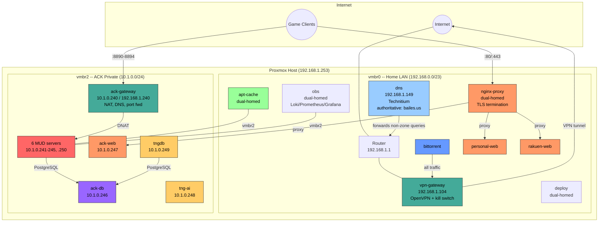

# Architecture Overview

Everything runs on a single Proxmox VE host (`192.168.1.253`) across two
bridges. The WOL game infrastructure and the *arr media stack have both been
removed; what remains is the homelab on the LAN and the legacy ACK! MUD
servers on their own isolated network.

## Network Diagram


```mermaid
graph TB
    subgraph Internet
        INET((Internet))
        PLAYERS((Game Clients))
    end

    subgraph PVE["Proxmox Host (192.168.1.253)"]
        subgraph VMBR0["vmbr0 -- Home LAN (192.168.0.0/23)"]
            ROUTER["Router<br/>192.168.1.1"]
            DNS["dns<br/>192.168.1.149<br/>Technitium<br/>authoritative: bailes.us"]
            VPN["vpn-gateway<br/>192.168.1.104<br/>OpenVPN + kill switch"]
            BT["bittorrent"]
            NGINX["nginx-proxy<br/>dual-homed<br/>TLS termination"]
            PWEB["personal-web"]
            RWEB["rakuen-web"]
            OBS["obs<br/>dual-homed<br/>Loki/Prometheus/Grafana"]
            CACHE["apt-cache<br/>dual-homed"]
            DEPLOY["deploy<br/>dual-homed"]
        end

        subgraph VMBR2["vmbr2 -- ACK Private (10.1.0.0/24)"]
            ACKGW["ack-gateway<br/>10.1.0.240 / 192.168.1.240<br/>NAT, DNS, port fwd"]
            ACKDB["ack-db<br/>10.1.0.246"]
            MUDS["6 MUD servers<br/>10.1.0.241-245, .250"]
            ACKWEB["ack-web<br/>10.1.0.247"]
            TNGAI["tng-ai<br/>10.1.0.248"]
            TNGDB["tngdb<br/>10.1.0.249"]
        end
    end

    INET --- ROUTER
    ROUTER --- VPN
    VPN -->|"VPN tunnel"| INET
    BT -->|"all traffic"| VPN

    DNS -->|"forwards non-zone queries"| ROUTER
    PLAYERS -->|":80/:443"| NGINX
    NGINX -->|"proxy"| ACKWEB
    NGINX -->|"proxy"| PWEB
    NGINX -->|"proxy"| RWEB
    PLAYERS -->|":8890-8894"| ACKGW
    ACKGW -->|"DNAT"| MUDS
    MUDS -->|"PostgreSQL"| ACKDB
    TNGDB -->|"PostgreSQL"| ACKDB

    CACHE ---|"vmbr2"| MUDS
    OBS ---|"vmbr2"| MUDS

    style DNS fill:#9cf,stroke:#333,color:#000
    style CACHE fill:#9f9,stroke:#333,color:#000
    style ACKGW fill:#4a9,stroke:#333,color:#000
    style VPN fill:#4a9,stroke:#333,color:#000
    style MUDS fill:#f66,stroke:#333,color:#000
    style ACKDB fill:#96f,stroke:#333,color:#000
    style BT fill:#69f,stroke:#333,color:#000
    style NGINX fill:#f96,stroke:#333,color:#000
    style PWEB fill:#f96,stroke:#333,color:#000
    style RWEB fill:#f96,stroke:#333,color:#000
    style ACKWEB fill:#f96,stroke:#333,color:#000
    style TNGAI fill:#fc6,stroke:#333,color:#000
    style TNGDB fill:#fc6,stroke:#333,color:#000
```

## Bridges

| Bridge | Subnet | Purpose |
|--------|--------|---------|
| `vmbr0` | 192.168.0.0/23 | Home LAN. Router at 192.168.1.1. Operator access, external-facing services, internet egress. |
| `vmbr2` | 10.1.0.0/24 | ACK private network. Legacy MUD servers. Own gateway with NAT, DNS and port forwarding. |

No traffic flows directly between bridges. Hosts that serve both are
dual-homed. `vmbr1` and `vmbr3` are gone with the WOL infrastructure.

## Addressing and naming

Hosts are addressed **by name**, not by IP.

CTIDs are assigned **sequentially from 101**, and a host's address is
`192.168.1.<CTID>` — the CTID *is* the address. Services still refer to each
other by name, so renumbering a host does not mean editing config across the
estate.

| CTID | Host | | CTID | Host |
|---|---|---|---|---|
| 101 | dns | | 106 | personal-web |
| *102* | *unifi (not managed here)* | | 107 | rakuen-web |
| 103 | apt-cache | | 108 | bittorrent |
| 104 | obs | | 109 | deploy |
| 105 | nginx-proxy | | 110 | vpn-gateway (VM) |

`dns` is first, so `192.168.1.101` is predictable — which matters because it is
the bootstrap floor: every other container needs somewhere to point
`--nameserver` before name resolution exists. It is the only address the bash
bootstrap needs to know.

The assignment lives in the `CTID_*` block of `homelab/bootstrap/lib/common.sh`
and in `host_order` in `terraform/hosts.tf`; those two must agree. Terraform
also writes the resolver's address to `homelab/bootstrap/lib/terraform.env`,
which `lib/common.sh` sources.

**ACK-side addresses are not renumbered.** Hosts that also sit on `vmbr2` keep
their existing `10.1.0.x` addresses (`obs` .100, `deploy` .101, `apt-cache`
.115, `nginx-proxy` .118), because `ack-gateway`'s dnsmasq has static entries
for them and that network is deliberately left alone.

## DNS (split horizon)

`dns` runs Technitium and is **authoritative for `bailes.us` on the LAN**.
Internal names resolve to internal addresses; everything else is forwarded to
the router at `192.168.1.1`.

> **This is a split-horizon zone.** Because the server is authoritative for
> `bailes.us`, it answers for the whole zone and never forwards a `bailes.us`
> lookup upstream. Any public `bailes.us` record you need from inside the LAN
> must be mirrored into the internal zone, or it returns NXDOMAIN internally.
> Other domains — `rakuensoftware.com`, `ackmud.com`, and the rest of the
> internet — are forwarded normally and are unaffected.

Hosts register their own records through the Technitium API
(`lib/dns-register.sh`), and Terraform registers what it provisions. Both write
with `overwrite=true`, so re-running either doubles as a repair.

The ACK network keeps its own `dnsmasq` on `ack-gateway` and is not part of the
internal zone; ACK hosts are still addressed numerically.

## TLS

Certificates come from Let's Encrypt via **HTTP-01 through nginx**, issued on
`nginx-proxy` — the arrangement that has been working, requiring no
credentials and no third-party DNS:

- `bailes.us`, `ackmud.com`, `rakuensoftware.com`, `rakuensoft.com` and their
  `www` / `aha` names

Renewal is certbot's own timer. HTTP-01 needs inbound `:80` to reach this host,
which is already how these sites are served.

### Internal hosts

Internal services (Grafana, the Technitium console) have **no publicly-trusted
certificate**. Giving them one means a wildcard, and a wildcard can only be
issued over DNS-01 — which requires moving DNS to a provider with an API
(these domains are at Namecheap). That is a lot of moving parts for a
convenience, so it is deliberately not done.

The machinery is present but switched off: uncomment the wildcard entry in
`CERTS` in `06-setup-nginx-proxy.sh` and drop an API token in
`secrets/cloudflare.ini` if you ever decide the trade is worth it. A certbot
deploy hook is already wired to distribute the wildcard to internal consumers,
and stays inert while no wildcard exists.

## Provisioning

Terraform (`terraform/`, `bpg/proxmox`) creates containers and their network.
The bash scripts in `homelab/bootstrap/` still do in-guest configuration: they
encode a lot of hard-won service setup, and rewriting that as Terraform would
trade working code for churn.

```
terraform apply          # containers + DNS records
homelab/bootstrap/*.sh   # in-guest configuration
```

## Self-healing

The VPN gateway and the ACK hosts run watchdogs that probe the **service**
rather than the process, because systemd reporting a unit `active` turned out
to be no evidence at all that it was working:

- `dnsmasq` on ack-gateway was dead for 18 days (startup race against `eth1`)
- `assault30` sat wedged for 6 days with a full accept queue, unit `active`
- `ack42` segfaulted every ~12 minutes, 739 times, silently recovering each time

See [homelab/ack/README.md](homelab/ack/README.md#self-healing) and
`homelab/bootstrap/lib/vpn-selfheal.sh`.

## Guest Summary

### Homelab (vmbr0)

CTIDs are dynamic; `terraform output hosts` is the source of truth.

| Hostname | Type | Role |
|----------|------|------|
| dns | LXC (pinned .149) | Technitium, authoritative for `bailes.us` |
| apt-cache | LXC (dual-homed) | apt-cacher-ng package cache |
| obs | LXC (dual-homed) | Loki + Prometheus + Grafana + Alertmanager |
| nginx-proxy | LXC (dual-homed) | Reverse proxy + ACME TLS termination |
| vpn-gateway | VM (cloud-init) | OpenVPN gateway with kill switch, self-healing |
| bittorrent | LXC (privileged) | qBittorrent-nox, routed via the VPN gateway |
| personal-web | LXC | Static file server (bailes.us) |
| rakuen-web | LXC | Static file server (rakuensoftware.com) |
| deploy | LXC (dual-homed) | GitHub Actions deployment (SSH :2222) |

### ACK (vmbr2) — 11 guests

| Hostname | IP | CTID | Role |
|----------|----|------|------|
| ack-gateway | 10.1.0.240 / 192.168.1.240 | 240 | NAT gateway, DNS, port forwarding |
| acktng | 10.1.0.241 | 241 | ACK!TNG MUD server (**:8890**) |
| ack431 | 10.1.0.242 | 242 | ACK! 4.3.1 MUD server (:8891) |
| ack42 | 10.1.0.243 | 243 | ACK! 4.2 MUD server (:8892) |
| ack41 | 10.1.0.244 | 244 | ACK! 4.1 MUD server (:8893) |
| assault30 | 10.1.0.245 | 245 | Assault 3.0 MUD server (:8894) |
| ackfuss | 10.1.0.250 | 250 | ACK!FUSS 4.4.1 MUD server |
| ack-db | 10.1.0.246 | 246 | PostgreSQL (postgres_exporter :9187) |
| ack-web | 10.1.0.247 | 247 | ackmud.com frontend + API (:5000) |
| tng-ai | 10.1.0.248 | 248 | NPC dialogue AI (:8000) |
| tngdb | 10.1.0.249 | 249 | Read-only game content API (:8000) |

ACK CTIDs stay static (240-254) — that network is deliberately left alone.

## Bootstrap Order

1. **dns** (`05-setup-dns.sh`) — nothing else can be addressed by name until
   this exists. Requires `DNS_ADMIN_PASSWORD`.
2. **apt-cache** (`00-setup-apt-cache.sh`) — everything else installs through it.
3. **vpn-gateway** (`01`), **obs** (`03`), **nginx-proxy** (`06`),
   **personal-web** (`07`), **deploy** (`09`), **rakuen-web** (`13`).
4. **Dashboards** (`08`) and host observability (`09-setup-proxmox-obs.sh`).
5. **ACK** (`homelab/ack/bootstrap/pve-setup-ack.sh`) — independent of the
   above apart from apt-cache and obs.

`00` and `05` each fall back to public resolvers, so neither blocks the other
on a cold start.
