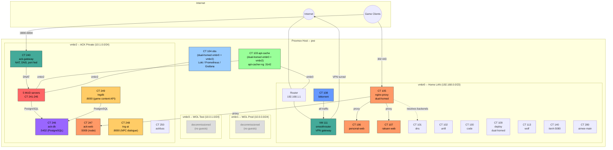

# Architecture Overview

Everything runs on a single Proxmox VE host (`pve`, 192.168.1.253) with four virtual bridges. Two of those bridges are currently in use; the WOL bridges remain configured but carry no guests.

Guests are identified by **CTID and hostname** (for example CT 108 `bittorrent`), not by IP address. Addresses are assigned at provisioning time and change; the CTID and hostname are the stable identifiers. Use `pct list` / `qm list` on the host to resolve a current address.

## Network Diagram

```mermaid
graph TB
    subgraph Internet
        INET((Internet))
        PLAYERS((Game Clients))
    end

    subgraph PVE["Proxmox Host -- pve"]
        subgraph VMBR0["vmbr0 -- Home LAN (192.168.0.0/23)"]
            ROUTER["Router<br/>192.168.1.1"]
            VPN["VM 111<br/>smoothrouter<br/>VPN gateway"]
            BT["CT 108<br/>bittorrent"]
            NGINX["CT 105<br/>nginx-proxy<br/>dual-homed"]
            PWEB["CT 106<br/>personal-web"]
            RWEB["CT 107<br/>rakuen-web"]
            DNS["CT 101<br/>dns"]
            UNIFI["CT 102<br/>unifi"]
            CODE["CT 100<br/>code"]
            DEPLOY["CT 109<br/>deploy<br/>dual-homed"]
            WOLF["CT 113<br/>wolf"]
            LLM["CT 140<br/>tierA-5080"]
            AIMEE["CT 280<br/>aimee-main"]
        end

        subgraph VMBR1["vmbr1 -- WOL Prod (10.0.0.0/24)"]
            WOLEMPTY["decommissioned<br/>(no guests)"]
        end

        subgraph VMBR3["vmbr3 -- WOL Test (10.0.1.0/24)"]
            TESTEMPTY["decommissioned<br/>(no guests)"]
        end

        subgraph VMBR2["vmbr2 -- ACK Private (10.1.0.0/24)"]
            ACKGW["CT 240<br/>ack-gateway<br/>NAT, DNS, port fwd"]
            ACKDB["CT 246<br/>ack-db<br/>:5432 (PostgreSQL)"]
            MUDS["5 MUD servers<br/>CT 241-245"]
            ACKWEB["CT 247<br/>ack-web<br/>:5000 (node)"]
            TNGAI["CT 248<br/>tng-ai<br/>:8000 (NPC dialogue)"]
            TNGDB["CT 249<br/>tngdb<br/>:8000 (game content API)"]
            ACKFUSS["CT 250<br/>ackfuss"]
        end

        CACHE["CT 103 apt-cache<br/>(dual-homed vmbr0 + vmbr2)<br/>apt-cacher-ng :3142"]
        OBS["CT 104 obs<br/>(dual-homed vmbr0 + vmbr2)<br/>Loki / Prometheus / Grafana"]
    end

    INET --- ROUTER
    ROUTER --- VPN
    VPN -->|"VPN tunnel"| INET
    BT -->|"all traffic"| VPN

    PLAYERS -->|":80/:443"| NGINX
    NGINX -->|"proxy"| ACKWEB
    NGINX -->|"proxy"| PWEB
    NGINX -->|"proxy"| RWEB
    NGINX -.->|"resolves backends"| DNS
    PLAYERS -->|":8890-8894"| ACKGW
    ACKGW -->|"DNAT"| MUDS
    MUDS -->|"PostgreSQL"| ACKDB
    TNGDB -->|"PostgreSQL"| ACKDB

    CACHE ---|"vmbr0"| ROUTER
    CACHE ---|"vmbr2"| MUDS
    OBS ---|"vmbr2"| MUDS

    style CACHE fill:#9f9,stroke:#333,color:#000
    style OBS fill:#9cf,stroke:#333,color:#000
    style ACKGW fill:#4a9,stroke:#333,color:#000
    style VPN fill:#4a9,stroke:#333,color:#000
    style MUDS fill:#f66,stroke:#333,color:#000
    style ACKDB fill:#96f,stroke:#333,color:#000
    style BT fill:#69f,stroke:#333,color:#000
    style NGINX fill:#f96,stroke:#333,color:#000
    style PWEB fill:#f96,stroke:#333,color:#000
    style RWEB fill:#f96,stroke:#333,color:#000
    style ACKWEB fill:#f96,stroke:#333,color:#000
    style TNGAI fill:#fc6,stroke:#333,color:#000
    style TNGDB fill:#fc6,stroke:#333,color:#000
    style WOLEMPTY fill:#ddd,stroke:#999,color:#666
    style TESTEMPTY fill:#ddd,stroke:#999,color:#666
```

## Bridges

| Bridge | Subnet | Purpose |
|--------|--------|---------|
| `vmbr0` | 192.168.0.0/23 | Home LAN. Router at 192.168.1.1. Operator access, external-facing services, internet egress. |
| `vmbr1` | 10.0.0.0/24 | Former WOL prod network. **Decommissioned** -- bridge configured, no guests. |
| `vmbr2` | 10.1.0.0/24 | ACK private network. Legacy MUD servers. Own gateway with port forwarding. |
| `vmbr3` | 10.0.1.0/24 | Former WOL test network. **Decommissioned** -- bridge configured, no guests. |

No traffic flows directly between bridges. Shared hosts (CT 103 `apt-cache`, CT 104 `obs`, CT 105 `nginx-proxy`, CT 109 `deploy`) are dual-homed on vmbr0 and vmbr2 to provide services across both live networks.

## WOL (vmbr1 + vmbr3) -- decommissioned

> **Decommissioned.** The World of Legends infrastructure no longer exists. All 19 guests (18 LXC + 1 VM) have been removed. The `vmbr1` and `vmbr3` bridges remain configured on the host but have `bridge-ports none` and carry no guests.
>
> The WOL documentation is retained as a design record only. See [WOL README](wol/README.md), [WOL diagrams](wol/diagrams.md), [host inventory](wol/hosts.md), [deployment guide](wol/proxmox/README.md) -- none of it describes running infrastructure.

## Homelab (vmbr0)

General-purpose services on the home LAN.

- **VM 111 `smoothrouter`** -- VPN gateway with kill switch. Any device that routes through it gets VPN protection. Replaces the former `vpn-gateway` VM.
- **CT 108 `bittorrent`** -- qBittorrent-nox with triple-layer VPN enforcement (routing, iptables, watchdog). Routes through VM 111. Downloads to NAS via NFS.
- **CT 103 `apt-cache`** -- dual-homed package cache, described below.
- **CT 104 `obs`** -- dual-homed observability stack (Loki, Prometheus, Grafana, Alertmanager), described below.
- **CT 105 `nginx-proxy`** -- dual-homed nginx reverse proxy with certbot TLS. Routes ackmud.com, aha.ackmud.com, bailes.us, rakuensoftware.com, and the rakuensoft.com redirect to their respective backends.
- **CT 109 `deploy`** -- dual-homed deployment container. GitHub Actions SSHs in to build and deploy artifacts. Key-only auth, GitHub IP allowlist.
- **CT 106 `personal-web`** -- static file server (node serve on :3000) for bailes.us.
- **CT 107 `rakuen-web`** -- static file server (node serve on :3000) for rakuensoftware.com. Builds the Vite/React site in-container.
- **CT 101 `dns`** -- Technitium DNS server (:53), admin UI on :5380. Authoritative for the `bailes.us` local zone and the reason hosts can be referred to by name anywhere in this repo. Its records are **derived from live Proxmox state** by `homelab/bootstrap/15-setup-dns.sh`, not maintained by hand, so renumbering a guest is corrected by re-running that script. Anything outside the local zone is forwarded to the router. LAN guests use it as their primary nameserver with the router as secondary; `bittorrent` and `ack-gateway` are deliberately excluded (see the bootstrap README).
- **CT 102 `unifi`** -- UniFi Network controller (:8443 UI, :8080 inform, :6789, :8843) backed by MongoDB.
- **CT 100 `code`** -- development and tooling container.
- **CT 280 `aimee-main`** -- aimee agent host, Docker-based services on :8443 and :8743.
- **CT 113 `wolf`** -- Wolf cloud gaming for Moonlight-compatible game streaming. Privileged OCI container with GPU passthrough.
- **CT 140 `tierA-5080`** -- GPU LLM inference host (DHCP addressed). Replaces the former `qwen103` container.

See: [Homelab README](homelab/README.md), [homelab diagrams](homelab/diagrams.md), [bootstrap guide](homelab/bootstrap/README.md)

## ACK (vmbr2)

Legacy ACK! MUD game servers on an isolated network. Five MUD servers plus `ackfuss`, `ack-db`, `ack-web`, `tng-ai`, `tngdb`, and a gateway on `vmbr2` (10.1.0.0/24). CT 240 `ack-gateway` provides NAT, DNS (dnsmasq), and port forwarding (external ports 8890-8894 map to internal :4000). CT 246 `ack-db` runs PostgreSQL for game world data, player records, and the help system. CT 247 `ack-web` serves both `ackmud.com` and `aha.ackmud.com` from the `ack-web` repo as a frontend plus node API on :5000, proxied by CT 105 `nginx-proxy`. CT 248 `tng-ai` provides NPC dialogue via Groq LLM API. CT 249 `tngdb` provides a read-only game content API.

Shared resources (present on both live bridges): CT 103 `apt-cache` for package caching, CT 104 `obs` for log/metric aggregation, CT 105 `nginx-proxy` for web traffic routing. All ACK hosts run Promtail, shipping logs to Loki (tenant: `ack`). CT 246 `ack-db` runs postgres_exporter on :9187, scraped by Prometheus on CT 104 `obs`.

See: [ACK README](homelab/ack/README.md), [ACK diagrams](homelab/ack/diagrams.md)

## Shared Services

### CT 103 `apt-cache` (dual-homed)

Runs apt-cacher-ng on port 3142. Present on vmbr0 and vmbr2. Caches .deb packages on first download and serves them from cache on subsequent requests. HTTPS apt repos are tunneled (not cached).

| Interface | Bridge | Clients |
|-----------|--------|---------|
| eth0 | vmbr0 | LAN hosts; fetches packages from public mirrors |
| eth1 | vmbr2 | ACK hosts |

Each network's hosts point `/etc/apt/apt.conf.d/01proxy` at the apt-cache address on their own bridge. ACK and homelab bootstrap scripts configure this themselves.

> Historical note: apt-cache was previously quad-homed across all four bridges. The vmbr1 and vmbr3 interfaces were removed with the WOL decommission.

### CT 104 `obs` (dual-homed)

Centralized observability for both live networks. Runs Loki (log aggregation), Prometheus (metrics), Alertmanager (alert routing), and Grafana (dashboards).

| Interface | Bridge | Clients |
|-----------|--------|---------|
| eth0 | vmbr0 | Grafana dashboards (:80), Proxmox log/metric ingestion |
| eth1 | vmbr2 | ACK hosts: Promtail (TLS) |

ACK hosts push over TLS (no PKI). Grafana is exposed on the LAN interface for operator access.

> Historical note: obs was previously tri-homed and received WOL host logs over mTLS using cfssl client certificates. That path was removed with the WOL decommission.

### Gateways

Each live network has its own gateway for NAT and DNS. They are independent and do not route traffic between networks.

| Network | Gateway | NAT | DNS | NTP |
|---------|---------|-----|-----|-----|
| ACK (vmbr2) | CT 240 `ack-gateway` | Single | dnsmasq | No |
| LAN (vmbr0) | Router (192.168.1.1) | Home router | Home router | Home router |
| VPN egress | VM 111 `smoothrouter` | Tunnel + kill switch | -- | -- |

## Guest Summary

### Homelab (vmbr0) -- 13 LXC + 1 VM

| CTID | Hostname | Type | Role |
|------|----------|------|------|
| CT 100 | `code` | LXC | Development and tooling container |
| CT 101 | `dns` | LXC | Technitium DNS (:53, admin :5380) |
| CT 102 | `unifi` | LXC | UniFi Network controller (:8443) + MongoDB |
| CT 103 | `apt-cache` | LXC (dual-homed vmbr0+vmbr2) | apt-cacher-ng package cache (:3142) |
| CT 104 | `obs` | LXC (dual-homed vmbr0+vmbr2) | Loki + Prometheus + Grafana + Alertmanager |
| CT 105 | `nginx-proxy` | LXC (dual-homed vmbr0+vmbr2) | nginx reverse proxy + certbot TLS for all web sites |
| CT 106 | `personal-web` | LXC | Static file server for bailes.us (:3000) |
| CT 107 | `rakuen-web` | LXC | Static file server for rakuensoftware.com (:3000) |
| CT 108 | `bittorrent` | LXC | qBittorrent-nox, VPN-enforced via VM 111 |
| CT 109 | `deploy` | LXC (dual-homed vmbr0+vmbr2) | GitHub Actions deployment over SSH |
| CT 113 | `wolf` | OCI (privileged) | Wolf cloud gaming (Moonlight streaming), GPU passthrough |
| CT 140 | `tierA-5080` | LXC (privileged) | GPU LLM inference host (DHCP) |
| CT 280 | `aimee-main` | LXC | aimee agent host, Docker services (:8443, :8743) |
| VM 111 | `smoothrouter` | VM (cloud-init) | VPN gateway with kill switch |

CT 110 is a stopped OCI template and is not a running guest.

### ACK (vmbr2) -- 11 LXC

| CTID | Hostname | Role |
|------|----------|------|
| CT 240 | `ack-gateway` | NAT gateway, DNS, port forwarding (dual-homed vmbr0+vmbr2) |
| CT 241 | `acktng` | ACK!TNG MUD server (:8890) |
| CT 242 | `ack431` | ACK! 4.3.1 MUD server (:8891) |
| CT 243 | `ack42` | ACK! 4.2 MUD server (:8892) |
| CT 244 | `ack41` | ACK! 4.1 MUD server (:8893) |
| CT 245 | `assault30` | Assault 3.0 MUD server (:8894) |
| CT 246 | `ack-db` | PostgreSQL database (acktng, postgres_exporter on :9187) |
| CT 247 | `ack-web` | ackmud.com and aha.ackmud.com (node on :5000) |
| CT 248 | `tng-ai` | NPC dialogue AI (Python/FastAPI/Groq on :8000) |
| CT 249 | `tngdb` | Read-only game content API (Python/FastAPI on :8000) |
| CT 250 | `ackfuss` | ACK! FUSS MUD server |

### WOL (vmbr1 + vmbr3) -- 0 guests

Decommissioned. See the WOL section above.

**Total: 25 running guests** (24 LXC + 1 VM) on one Proxmox host.

## Bootstrap Order

Environments are bootstrapped independently but share one dependency: **apt-cache must exist first** for fast package installs.

1. **Homelab** (`homelab/bootstrap/`) -- apt-cache, VPN gateway, bittorrent, obs, nginx-proxy, personal-web, deploy, rakuen-web. Numbered step prefixes in that directory define the order.

   nginx-proxy is the exception to running these in order: its vhosts name their backends, so it needs the dns container serving the `bailes.us` zone with records for personal-web and rakuen-web already in place. It checks this and refuses to configure rather than writing a config that will not parse.
2. **ACK** (`homelab/ack/bootstrap/pve-setup-ack.sh`) -- creates bridge, containers, and bootstraps gateway + ack-db + MUD servers + ack-web + tng-ai + tngdb.

Bootstrap scripts resolve hosts by CTID and hostname via `resolve_ctid` in `homelab/bootstrap/lib/common.sh`; they still carry literal addresses where the provisioning step must assign one.

> The WOL orchestrator (`wol/proxmox/pve-deploy.sh`) is retained but no longer runs against live infrastructure.
