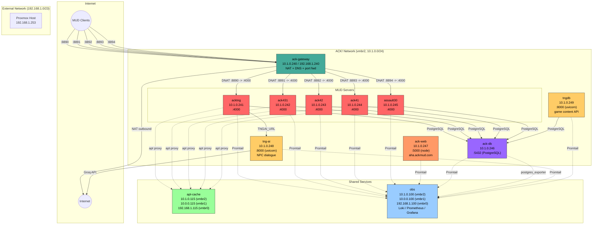
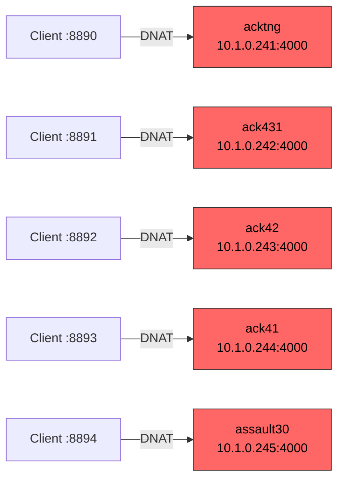
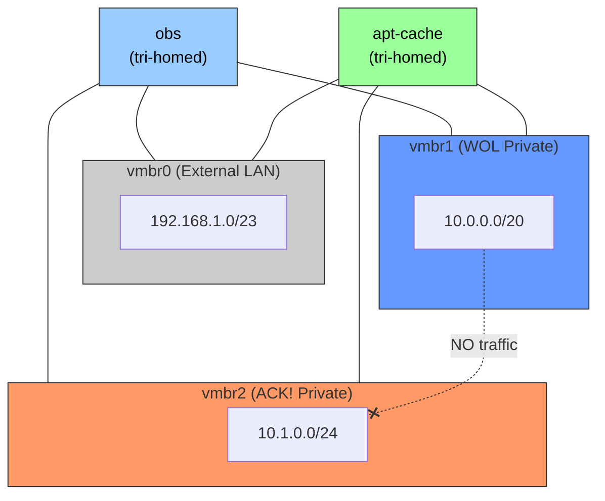

# ACK! MUD Network Diagrams

All diagrams use Mermaid syntax.

---

## Network Topology

## Port Forwarding

## Network Isolation

## Host Reference

| IP | Hostname | CTID | Bridge | Role |
|----|----------|------|--------|------|
| 10.1.0.240 / 192.168.1.240 | ack-gateway | 240 | vmbr0 + vmbr2 | NAT gateway, DNS, port forwarding |
| 10.1.0.241 | acktng | 241 | vmbr2 | ACK!TNG MUD server |
| 10.1.0.242 | ack431 | 242 | vmbr2 | ACK! 4.3.1 MUD server |
| 10.1.0.243 | ack42 | 243 | vmbr2 | ACK! 4.2 MUD server |
| 10.1.0.244 | ack41 | 244 | vmbr2 | ACK! 4.1 MUD server |
| 10.1.0.245 | assault30 | 245 | vmbr2 | Assault 3.0 MUD server |
| 10.1.0.246 | ack-db | 246 | vmbr2 | PostgreSQL database (acktng) |
| 10.1.0.247 | ack-web | 247 | vmbr2 | AHA web app (aha.ackmud.com) |
| 10.1.0.248 | tng-ai | 248 | vmbr2 | NPC dialogue AI (Python/FastAPI/Groq) |
| 10.1.0.249 | tngdb | 249 | vmbr2 | Read-only game content API (Python/FastAPI) |
| 10.1.0.115 | apt-cache | 115 | vmbr0 + vmbr1 + vmbr2 | Package cache (shared) |
| 10.1.0.100 | obs | 100 | vmbr0 + vmbr1 + vmbr2 | Observability stack (shared) |
