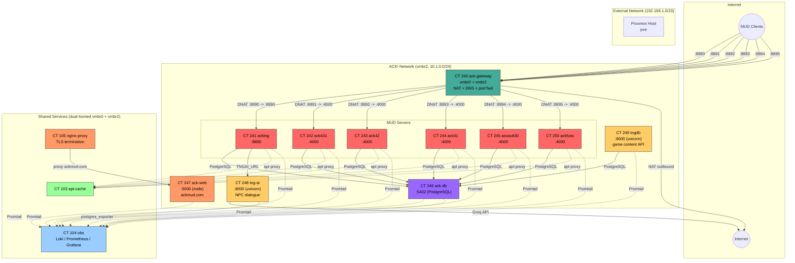
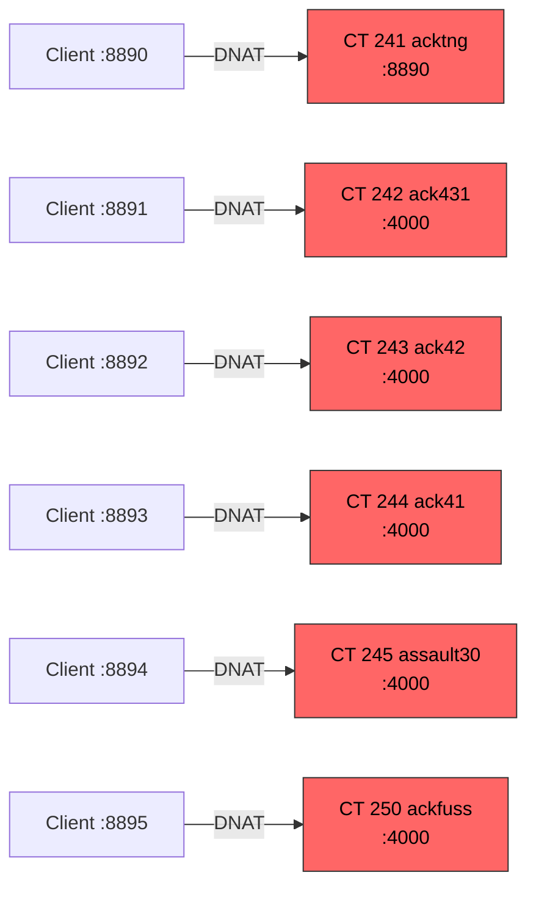
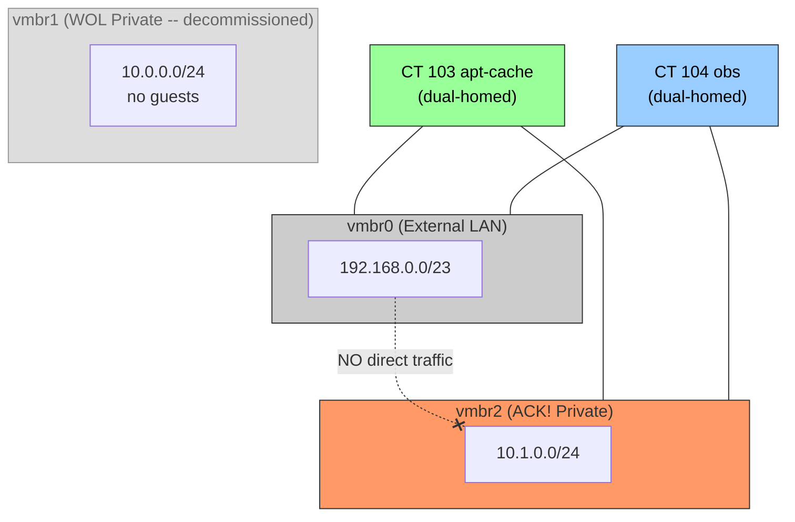

# ACK! MUD Network Diagrams

All diagrams use Mermaid syntax. Hosts are identified by CTID and hostname.

---

## Network Topology

```mermaid
graph TB
    subgraph Internet
        INET((Internet))
        PLAYERS((MUD Clients))
    end

    subgraph EXT["External Network (192.168.1.0/23)"]
        PVE["Proxmox Host<br/>pve"]
    end

    subgraph ACK["ACK! Network (vmbr2, 10.1.0.0/24)"]
        GW["CT 240 ack-gateway<br/>vmbr0 + vmbr2<br/>NAT + DNS + port fwd"]

        ACKDB["CT 246 ack-db<br/>:5432 (PostgreSQL)"]

        subgraph MUDS["MUD Servers"]
            TNG["CT 241 acktng<br/>:8890"]
            V431["CT 242 ack431<br/>:4000"]
            V42["CT 243 ack42<br/>:4000"]
            V41["CT 244 ack41<br/>:4000"]
            ASS["CT 245 assault30<br/>:4000"]
            FUSS["CT 250 ackfuss<br/>:4000"]
        end

        ACKWEB["CT 247 ack-web<br/>:5000 (node)<br/>ackmud.com"]

        TNGAI["CT 248 tng-ai<br/>:8000 (uvicorn)<br/>NPC dialogue"]
        TNGDB["CT 249 tngdb<br/>:8000 (uvicorn)<br/>game content API"]
    end

    subgraph SHARED["Shared Services (dual-homed vmbr0 + vmbr2)"]
        CACHE["CT 103 apt-cache"]
        OBS["CT 104 obs<br/>Loki / Prometheus / Grafana"]
        NGINX["CT 105 nginx-proxy<br/>TLS termination"]
    end

    PLAYERS -->|":8890"| GW
    PLAYERS -->|":8891"| GW
    PLAYERS -->|":8892"| GW
    PLAYERS -->|":8893"| GW
    PLAYERS -->|":8894"| GW
    PLAYERS -->|":8895"| GW

    GW -->|"DNAT :8890 -> :8890"| TNG
    GW -->|"DNAT :8891 -> :4000"| V431
    GW -->|"DNAT :8892 -> :4000"| V42
    GW -->|"DNAT :8893 -> :4000"| V41
    GW -->|"DNAT :8894 -> :4000"| ASS
    GW -->|"DNAT :8895 -> :4000"| FUSS

    GW -->|"NAT outbound"| INET

    TNG -->|"PostgreSQL"| ACKDB
    V431 -->|"PostgreSQL"| ACKDB
    V42 -->|"PostgreSQL"| ACKDB
    V41 -->|"PostgreSQL"| ACKDB
    ASS -->|"PostgreSQL"| ACKDB
    FUSS -->|"PostgreSQL"| ACKDB

    TNG -->|"TNGAI_URL"| TNGAI
    TNGAI -->|"Groq API"| INET
    TNGDB -->|"PostgreSQL"| ACKDB

    NGINX -->|"proxy ackmud.com"| ACKWEB

    TNG -.->|"apt proxy"| CACHE
    V431 -.->|"apt proxy"| CACHE
    V42 -.->|"apt proxy"| CACHE
    V41 -.->|"apt proxy"| CACHE
    ASS -.->|"apt proxy"| CACHE
    FUSS -.->|"apt proxy"| CACHE

    TNG -.->|"Promtail"| OBS
    V431 -.->|"Promtail"| OBS
    V42 -.->|"Promtail"| OBS
    V41 -.->|"Promtail"| OBS
    ASS -.->|"Promtail"| OBS
    FUSS -.->|"Promtail"| OBS
    ACKWEB -.->|"Promtail"| OBS
    ACKDB -.->|"Promtail"| OBS
    ACKDB -.->|"postgres_exporter"| OBS
    TNGAI -.->|"Promtail"| OBS
    TNGDB -.->|"Promtail"| OBS

    style ACKDB fill:#96f,stroke:#333,color:#000
    style GW fill:#4a9,stroke:#333,color:#000
    style ACKWEB fill:#f96,stroke:#333,color:#000
    style NGINX fill:#f96,stroke:#333,color:#000
    style TNGAI fill:#fc6,stroke:#333,color:#000
    style TNGDB fill:#fc6,stroke:#333,color:#000
    style TNG fill:#f66,stroke:#333,color:#000
    style V431 fill:#f66,stroke:#333,color:#000
    style V42 fill:#f66,stroke:#333,color:#000
    style V41 fill:#f66,stroke:#333,color:#000
    style ASS fill:#f66,stroke:#333,color:#000
    style FUSS fill:#f66,stroke:#333,color:#000
    style CACHE fill:#9f9,stroke:#333,color:#000
    style OBS fill:#9cf,stroke:#333,color:#000
```

## Port Forwarding

```mermaid
graph LR
    C1["Client :8890"] -->|DNAT| TNG["CT 241 acktng<br/>:8890"]
    C2["Client :8891"] -->|DNAT| V431["CT 242 ack431<br/>:4000"]
    C3["Client :8892"] -->|DNAT| V42["CT 243 ack42<br/>:4000"]
    C4["Client :8893"] -->|DNAT| V41["CT 244 ack41<br/>:4000"]
    C5["Client :8894"] -->|DNAT| ASS["CT 245 assault30<br/>:4000"]
    C6["Client :8895"] -->|DNAT| FUSS["CT 250 ackfuss<br/>:4000"]

    style TNG fill:#f66,stroke:#333,color:#000
    style V431 fill:#f66,stroke:#333,color:#000
    style V42 fill:#f66,stroke:#333,color:#000
    style V41 fill:#f66,stroke:#333,color:#000
    style ASS fill:#f66,stroke:#333,color:#000
    style FUSS fill:#f66,stroke:#333,color:#000
```

## Network Isolation

```mermaid
graph TB
    subgraph VMBR0["vmbr0 (External LAN)"]
        EXT["192.168.0.0/23"]
    end

    subgraph VMBR1["vmbr1 (WOL Private -- decommissioned)"]
        WOL["10.0.0.0/24<br/>no guests"]
    end

    subgraph VMBR2["vmbr2 (ACK! Private)"]
        ACK["10.1.0.0/24"]
    end

    CACHE["CT 103 apt-cache<br/>(dual-homed)"]
    OBS2["CT 104 obs<br/>(dual-homed)"]

    CACHE --- VMBR0
    CACHE --- VMBR2
    OBS2 --- VMBR0
    OBS2 --- VMBR2

    EXT -.-x|"NO direct traffic"| ACK

    style VMBR0 fill:#ccc,stroke:#333
    style VMBR1 fill:#ddd,stroke:#999,color:#666
    style VMBR2 fill:#f96,stroke:#333
    style CACHE fill:#9f9,stroke:#333,color:#000
    style OBS2 fill:#9cf,stroke:#333,color:#000
```

## Host Reference

| CTID | Hostname | Bridge | Role |
|------|----------|--------|------|
| CT 240 | `ack-gateway` | vmbr0 + vmbr2 | NAT gateway, DNS, port forwarding |
| CT 241 | `acktng` | vmbr2 | ACK!TNG MUD server |
| CT 242 | `ack431` | vmbr2 | ACK! 4.3.1 MUD server |
| CT 243 | `ack42` | vmbr2 | ACK! 4.2 MUD server |
| CT 244 | `ack41` | vmbr2 | ACK! 4.1 MUD server |
| CT 245 | `assault30` | vmbr2 | Assault 3.0 MUD server |
| CT 246 | `ack-db` | vmbr2 | PostgreSQL database (acktng) |
| CT 247 | `ack-web` | vmbr2 | ACK web app (ackmud.com) |
| CT 248 | `tng-ai` | vmbr2 | NPC dialogue AI (Python/FastAPI/Groq) |
| CT 249 | `tngdb` | vmbr2 | Read-only game content API (Python/FastAPI) |
| CT 250 | `ackfuss` | vmbr2 | ACK!FUSS 4.4.1 MUD server |
| CT 103 | `apt-cache` | vmbr0 + vmbr2 | Package cache (shared) |
| CT 104 | `obs` | vmbr0 + vmbr2 | Observability stack (shared) |
| CT 105 | `nginx-proxy` | vmbr0 + vmbr2 | Reverse proxy + TLS (shared) |
| CT 109 | `deploy` | vmbr0 + vmbr2 | Deployment target (shared) |
