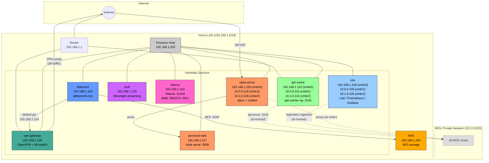
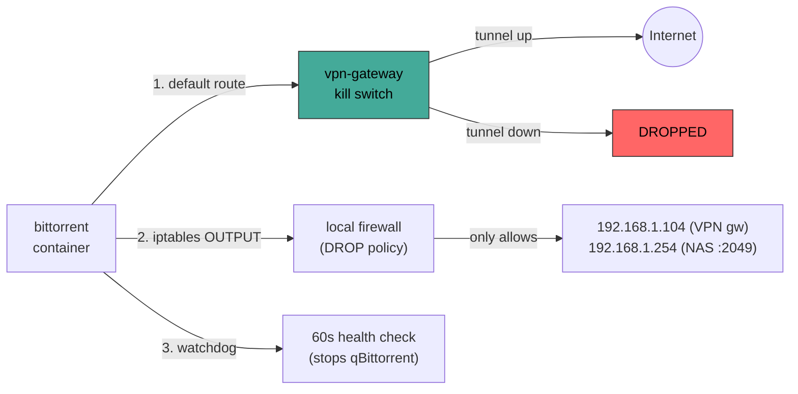

# Homelab Infrastructure Diagrams

Visual reference for the homelab infrastructure. All diagrams use Mermaid syntax.

---

## Network Topology

## VPN Kill Switch (Three Layers)

## Host Reference

| IP | Hostname | ID | Type | Role |
|----|----------|------|------|------|
| 192.168.1.115 (vmbr0), 10.0.0.115 (vmbr1), 10.1.0.115 (vmbr2) | apt-cache | 115 | LXC (unprivileged, tri-homed) | apt-cacher-ng package cache for all networks |
| 192.168.1.100 (vmbr0), 10.0.0.100 (vmbr1), 10.1.0.100 (vmbr2) | obs | 215 | LXC (unprivileged, tri-homed) | Loki + Prometheus + Grafana + Alertmanager |
| 192.168.1.104 | vpn-gateway | 104 | VM (cloud-init) | OpenVPN gateway with kill switch |
| 192.168.1.116 | bittorrent | 116 | LXC (privileged) | qBittorrent-nox, triple VPN enforcement |
| 192.168.1.117 | personal-web | 117 | LXC (unprivileged) | Static file server (bailes.us) on :3000 |
| 192.168.1.118 (vmbr0), 10.0.0.118 (vmbr1), 10.1.0.118 (vmbr2) | nginx-proxy | 118 | LXC (unprivileged, tri-homed) | nginx reverse proxy + certbot TLS for all web sites |
| 192.168.1.120 | wolf | 120 | LXC (privileged, GPU passthrough) | Wolf cloud gaming (Moonlight streaming) |
| 192.168.1.103 | ollama | 103 | LXC (privileged, AMD 7900XTX GPU) | Ollama LLM inference, OpenAI-compatible API on :11434 |
| 192.168.1.253 | pve | N/A | Proxmox host | Hypervisor |
| 192.168.1.254 | nas | N/A | NAS | NFS storage for downloads |
