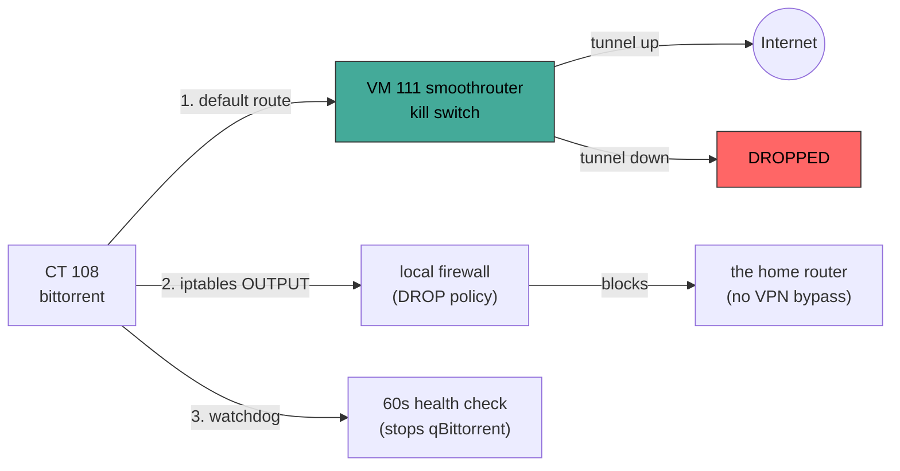

# Homelab Infrastructure Diagrams

Visual reference for the homelab infrastructure. All diagrams use Mermaid syntax.

Hosts are identified by CTID and hostname. Resolve current addresses on the
Proxmox host with `pct list` / `qm list`.

---

## Network Topology

```mermaid
graph TB
    subgraph Internet
        INET((Internet))
    end

    subgraph LAN["Home LAN (192.168.1.0/23)"]
        ROUTER["Router<br/>192.168.1.1"]

        subgraph HOMELAB["Homelab Services"]
            APTCACHE["CT 103 apt-cache<br/>vmbr0 + vmbr2<br/>apt-cacher-ng :3142"]
            OBS["CT 104 obs<br/>vmbr0 + vmbr2<br/>Loki / Prometheus / Grafana"]
            VPN["VM 111 smoothrouter<br/>VPN gateway + kill switch"]
            BT["CT 108 bittorrent<br/>qBittorrent-nox"]
            NGINX["CT 105 nginx-proxy<br/>vmbr0 + vmbr2<br/>nginx + certbot"]
            PWEB["CT 106 personal-web<br/>node serve :3000"]
            RWEB["CT 107 rakuen-web<br/>node serve :3000"]
            DEPLOY["CT 109 deploy<br/>vmbr0 + vmbr2<br/>GitHub Actions target"]
            DNS["CT 101 dns<br/>Technitium :53"]
            UNIFI["CT 102 unifi<br/>UniFi controller :8443"]
            CODE["CT 100 code<br/>dev + tooling"]
            AIMEE["CT 280 aimee-main<br/>Docker :8443 / :8743"]
            WOLF["CT 113 wolf<br/>Moonlight streaming"]
            LLM["CT 140 tierA-5080<br/>GPU LLM inference"]
        end

        NAS["NAS<br/>192.168.1.254<br/>NFS storage"]
        PVE["Proxmox Host<br/>pve<br/>192.168.1.253"]
    end

    subgraph ACK["ACK Private Network (10.1.0.0/24)"]
        ACKHOSTS["ACK hosts<br/>CT 240-250"]
    end

    INET --- ROUTER
    ROUTER --- VPN
    ROUTER --- APTCACHE
    VPN -->|"VPN tunnel<br/>(all traffic)"| INET
    BT -->|"default gw"| VPN
    BT -->|"NFS :2049"| NAS
    APTCACHE -.->|"apt proxy :3142<br/>(dual-homed)"| ACKHOSTS
    OBS -.->|"log/metric ingestion<br/>(dual-homed)"| ACKHOSTS
    DEPLOY -.->|"deploys<br/>(dual-homed)"| ACKHOSTS
    INET -->|":80/:443"| NGINX
    NGINX -->|"proxy"| PWEB
    NGINX -->|"proxy"| RWEB
    NGINX -.->|"proxy via vmbr2"| ACKHOSTS
    PVE --- VPN
    PVE --- BT
    PVE --- APTCACHE
    PVE --- OBS
    PVE --- NGINX
    PVE --- PWEB
    PVE --- RWEB
    PVE --- DEPLOY
    PVE --- DNS
    PVE --- UNIFI
    PVE --- CODE
    PVE --- AIMEE
    PVE --- WOLF
    PVE --- LLM

    style APTCACHE fill:#9f9,stroke:#333,color:#000
    style OBS fill:#9cf,stroke:#333,color:#000
    style VPN fill:#4a9,stroke:#333,color:#000
    style BT fill:#69f,stroke:#333,color:#000
    style NGINX fill:#f96,stroke:#333,color:#000
    style PWEB fill:#f96,stroke:#333,color:#000
    style RWEB fill:#f96,stroke:#333,color:#000
    style DEPLOY fill:#ccf,stroke:#333,color:#000
    style DNS fill:#9cf,stroke:#333,color:#000
    style UNIFI fill:#9cf,stroke:#333,color:#000
    style CODE fill:#ddd,stroke:#333,color:#000
    style AIMEE fill:#ddd,stroke:#333,color:#000
    style NAS fill:#fa0,stroke:#333,color:#000
    style PVE fill:#ccc,stroke:#333,color:#000
    style ACKHOSTS fill:#ddd,stroke:#999,color:#333
    style WOLF fill:#c6f,stroke:#333,color:#000
    style LLM fill:#f6c,stroke:#333,color:#000
```

## VPN Kill Switch (Three Layers)

```mermaid
graph LR
    BT["CT 108<br/>bittorrent"] -->|"1. default route"| VPN["VM 111 smoothrouter<br/>kill switch"]
    BT -->|"2. iptables OUTPUT"| FW["local firewall<br/>(DROP policy)"]
    BT -->|"3. watchdog"| WD["60s health check<br/>(stops qBittorrent)"]

    VPN -->|"tunnel up"| INET((Internet))
    VPN -->|"tunnel down"| DROP["DROPPED"]

    FW -->|"blocks"| BLOCKED["the home router<br/>(no VPN bypass)"]

    style DROP fill:#f66,stroke:#333,color:#000
    style VPN fill:#4a9,stroke:#333,color:#000
```

> On the running container the watchdog reads its expected gateway from
> `/etc/vpn-watchdog.conf` and refuses to run if that value is absent, rather
> than guessing. The `02-setup-bittorrent.sh` bootstrap script still hard-codes
> the old gateway address and has not been updated to match.

## Host Reference

| CTID | Hostname | Type | Role |
|------|----------|------|------|
| CT 100 | `code` | LXC | Development and tooling container |
| CT 101 | `dns` | LXC | Technitium DNS (:53), admin UI :5380 |
| CT 102 | `unifi` | LXC | UniFi Network controller (:8443) + MongoDB |
| CT 103 | `apt-cache` | LXC (unprivileged, dual-homed vmbr0+vmbr2) | apt-cacher-ng package cache |
| CT 104 | `obs` | LXC (unprivileged, dual-homed vmbr0+vmbr2) | Loki + Prometheus + Grafana + Alertmanager |
| CT 105 | `nginx-proxy` | LXC (unprivileged, dual-homed vmbr0+vmbr2) | nginx reverse proxy + certbot TLS for all web sites |
| CT 106 | `personal-web` | LXC (unprivileged) | Static file server (bailes.us) on :3000 |
| CT 107 | `rakuen-web` | LXC (unprivileged) | Static file server (rakuensoftware.com) on :3000 |
| CT 108 | `bittorrent` | LXC (privileged) | qBittorrent-nox, triple VPN enforcement |
| CT 109 | `deploy` | LXC (dual-homed vmbr0+vmbr2) | GitHub Actions deployment target over SSH |
| CT 113 | `wolf` | OCI (privileged, GPU passthrough) | Wolf cloud gaming (Moonlight streaming) |
| CT 140 | `tierA-5080` | LXC (privileged, GPU) | LLM inference host (DHCP addressed) |
| CT 280 | `aimee-main` | LXC | aimee agent host, Docker services :8443 / :8743 |
| VM 111 | `smoothrouter` | VM (cloud-init) | VPN gateway with kill switch |
| -- | `pve` (192.168.1.253) | Proxmox host | Hypervisor |
| -- | `nas` (192.168.1.254) | NAS | NFS storage for downloads |

CT 110 is a stopped OCI template, not a running service.
