# WOL Infrastructure Diagrams

Visual reference for the WOL infrastructure proposals. All diagrams use Mermaid syntax.

**Cross-proposal dependencies:** These proposals are tightly coupled. The authoritative ownership boundaries are defined in `spiffe-spire-workload-identity.md` Section 8 (ownership table). When two proposals appear to conflict, that table is authoritative. Key dependency chain:

1. `private-ca-and-secret-management.md` (root CA, cfssl CA for DB certs, cert profiles, TLS policy, incident playbooks)
2. `spiffe-spire-workload-identity.md` (service-to-service mTLS, JWT-SVIDs; depends on #1 for root CA)
3. `proxmox-deployment-automation.md` (host provisioning and bootstrap orchestration; depends on #1 and #2 for bootstrap ordering)
4. `wol-accounts-db-and-api.md` (depends on #1 and #2)
6. `wol-world-db-and-api.md` (depends on #1 and #2)
7. `observability-stack.md` (depends on #1 and #3; all services depend on this for log/metric delivery)

---

## 1. Network Topology

Physical network layout showing all hosts, interfaces, and connectivity.

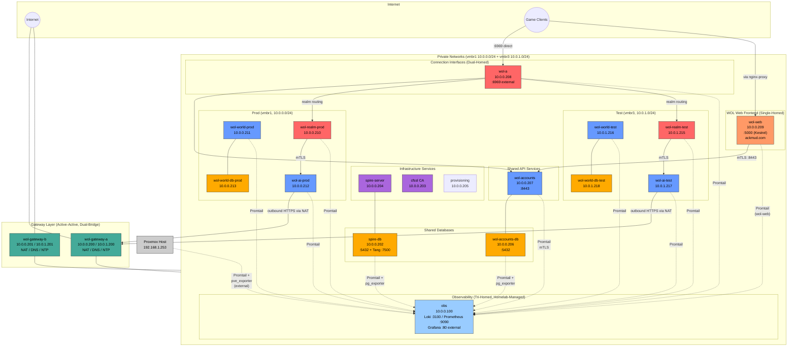

---

## 2. Gateway Active-Active (ECMP Routing)

How internal hosts use both gateways for outbound internet, DNS, and NTP.

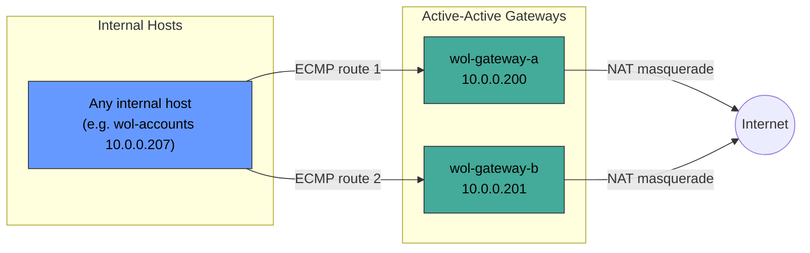

**Routing:** `ip route add default nexthop via 10.0.0.200 nexthop via 10.0.0.201`
**DNS:** `/etc/resolv.conf` lists both `nameserver 10.0.0.200` and `nameserver 10.0.0.201`
**NTP:** chrony config has `server 10.0.0.200 iburst` and `server 10.0.0.201 iburst`

---

## 3. Certificate Authority Trust Chain

Two-tier PKI: offline root CA with online intermediates for different purposes.

```mermaid
graph TD
    ROOT["WOL Root CA<br/>(offline, air-gapped)<br/>ECDSA P-256"]

    ROOT --> SPIRE_INT["SPIRE Intermediate CA<br/>(managed by SPIRE Server)<br/>Issues X.509-SVIDs"]
    ROOT --> STEP_INT["cfssl CA Intermediate CA<br/>(online, 10.0.0.203:8443)<br/>Issues PostgreSQL client certs"]
    ROOT --> VTPM_INT["vTPM Provisioning CA<br/>(online, 10.0.0.205)<br/>Issues DevID certs for node attestation"]

    SPIRE_INT --> SVID1["X.509-SVID<br/>spiffe://wol/accounts<br/>1h lifetime"]
    SPIRE_INT --> SVID2["X.509-SVID<br/>spiffe://wol/players<br/>1h lifetime"]
    SPIRE_INT --> SVID3["X.509-SVID<br/>spiffe://wol/world<br/>1h lifetime"]
    SPIRE_INT --> SVID4["X.509-SVID<br/>spiffe://wol/server-a<br/>1h lifetime"]
    SPIRE_INT --> SVID5["X.509-SVID<br/>spiffe://wol/realm-a<br/>1h lifetime"]
    SPIRE_INT --> SVID6["X.509-SVID<br/>spiffe://wol/ai<br/>1h lifetime"]

    STEP_INT --> DBCERT1["DB client cert<br/>CN=wol (runtime)<br/>24h lifetime"]
    STEP_INT --> DBCERT2["DB client cert<br/>CN=wol_migrate (DDL)<br/>24h lifetime"]
    STEP_INT --> DBCERT3["DB server certs<br/>CN=*-db hosts<br/>24h lifetime"]

    VTPM_INT --> DEVID1["DevID cert<br/>(per-VM vTPM)<br/>Node attestation"]

    style ROOT fill:#d32,stroke:#333,color:#fff
    style SPIRE_INT fill:#a6d,stroke:#333,color:#000
    style STEP_INT fill:#a6d,stroke:#333,color:#000
    style VTPM_INT fill:#a6d,stroke:#333,color:#000
    style SVID1 fill:#cdf,stroke:#333,color:#000
    style SVID2 fill:#cdf,stroke:#333,color:#000
    style SVID3 fill:#cdf,stroke:#333,color:#000
    style SVID4 fill:#cdf,stroke:#333,color:#000
    style SVID5 fill:#cdf,stroke:#333,color:#000
    style SVID6 fill:#cdf,stroke:#333,color:#000
    style DBCERT1 fill:#fda,stroke:#333,color:#000
    style DBCERT2 fill:#fda,stroke:#333,color:#000
    style DBCERT3 fill:#fda,stroke:#333,color:#000
    style DEVID1 fill:#fda,stroke:#333,color:#000
```

---

## 4. SPIRE Identity and Attestation Flow

How hosts and workloads obtain their identities.

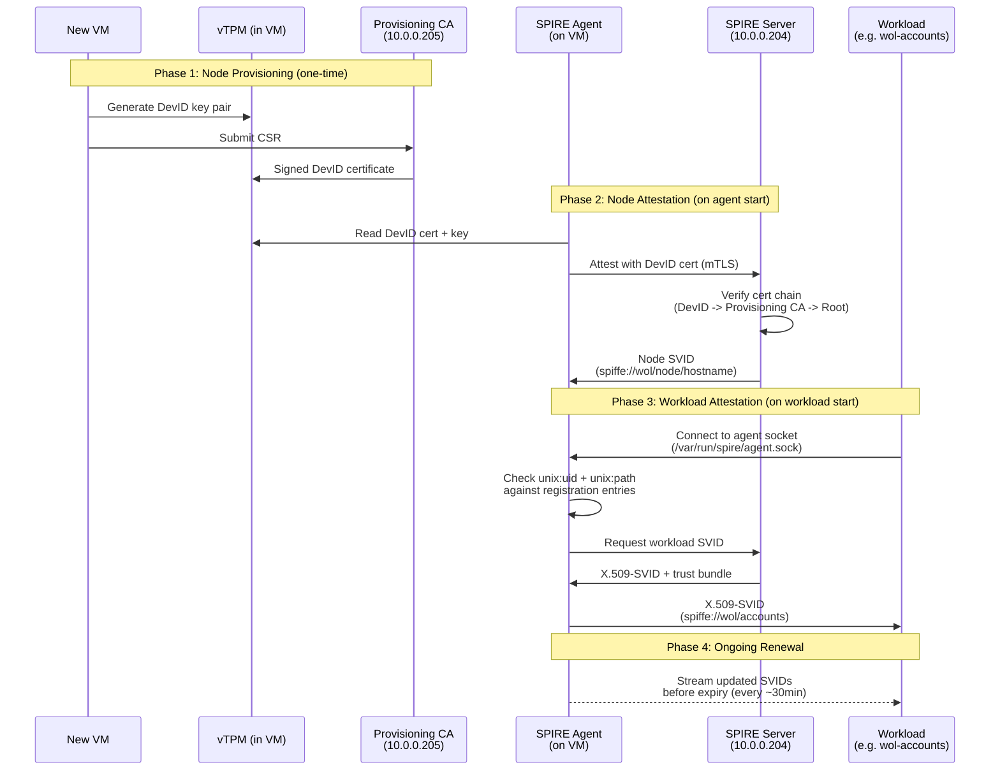

---

## 5. Service-to-Service Authentication (mTLS + JWT-SVID)

How wol instances authenticate to API services.

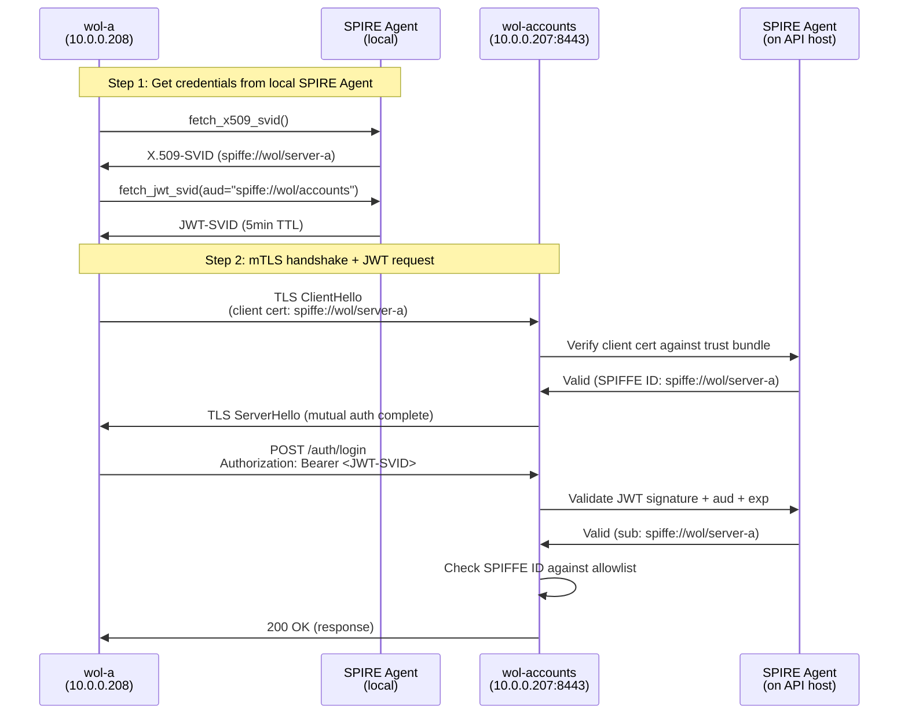

---

## 6. Client Connection Flow (Login to Gameplay)

End-to-end flow from a game client connecting through to active gameplay.

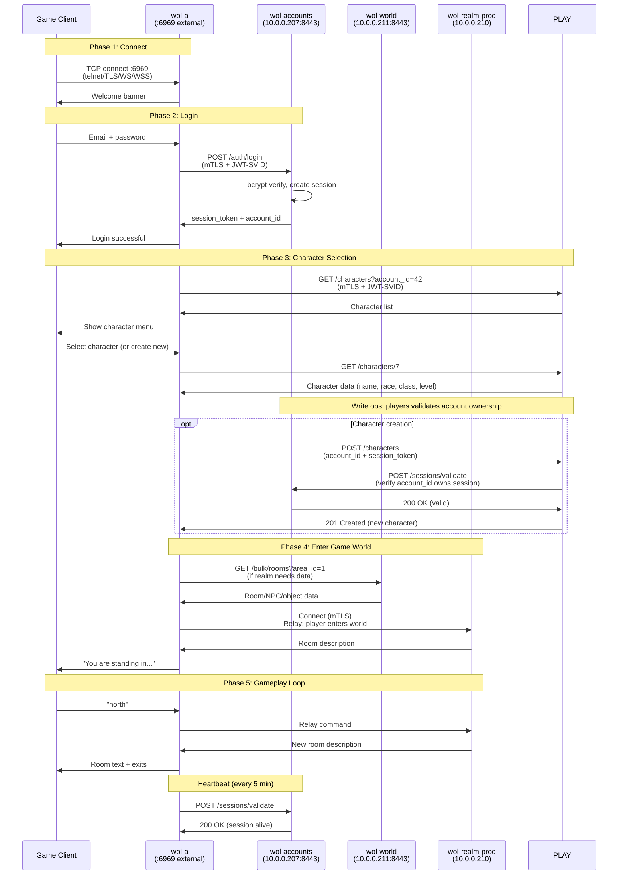

---

## 7. Database Connectivity

How API services connect to their databases using cfssl CA client certificates.

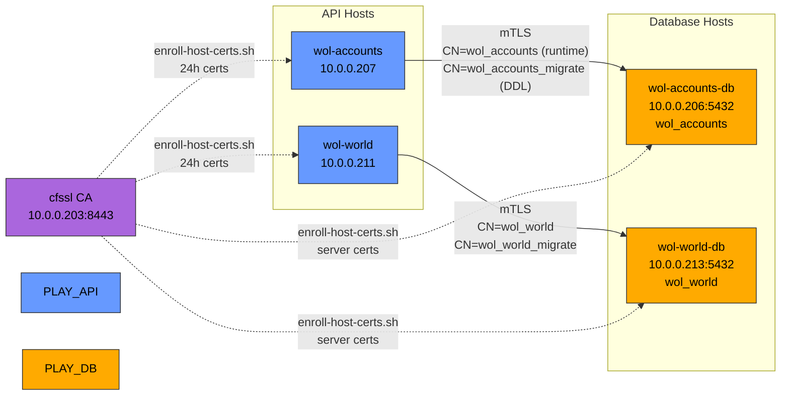

**pg_hba.conf pattern** (each DB host):
```
hostssl <db_name> <runtime_user>  <api_host>/32  cert clientcert=verify-full
hostssl <db_name> <migrate_user>  <api_host>/32  cert clientcert=verify-full
host    all       all             0.0.0.0/0      reject
```

---

## 8. Bootstrap Sequence

Order of operations for bringing up the entire infrastructure from scratch.

```mermaid
gantt
    title Bootstrap Sequence
    dateFormat X
    axisFormat %s

    section Network + Proxy
    00-setup-gateway.sh (both gateways)   :gw, 0, 1
    01-setup-apt-cache.sh                 :cache, 1, 2

    section Core Infrastructure
    02-setup-spire-db.sh (spire-db)        :db, 2, 3
    02-setup-wol-accounts-db.sh            :adb, 2, 3
    03-setup-cfssl CA.sh                   :ca, 3, 4
    04-setup-spire-server.sh              :ss, 4, 5
    05-setup-provisioning-host.sh         :prov, 5, 6
    06-complete-cfssl CA.sh                :ca2, 6, 7
    07-complete-spire-server.sh           :ss2, 7, 8
    08-complete-provisioning.sh           :prov2, 8, 9

    section SPIRE Agents
    09-setup-spire-agent.sh (all hosts)   :sa, 9, 10

    section API Services
    10-setup-wol-accounts.sh              :acct, 10, 11
    11-register-workload-entries.sh       :reg, 11, 12

    section Per-Environment Services
    12-setup-wol-world-db.sh              :wdb, 12, 13
    13-setup-wol-world.sh                 :wrld, 13, 14
    14-setup-wol-realm.sh                 :realm, 14, 15
    15-setup-wol.sh (connection interface) :wol, 15, 16
    16-setup-wol-ai.sh                    :ai, 13, 14

    section Observability + Web
    17-setup-obs.sh                   :obs, 16, 17
    18-setup-web.sh                       :web, 17, 18
    19-setup-promtail.sh (all hosts)      :prom, 18, 19
    20-setup-proxmox-obs.sh (PVE host)    :pve, 19, 20
```

**Dependencies:**
- Gateways must be up first (all hosts need DNS for apt)
- apt-cache must be up before all other hosts (provides caching proxy)
- cfssl CA before SPIRE Server (root CA trust)
- SPIRE Server before SPIRE Agents
- SPIRE Agents before any service that needs workload identity
- Workload registration before services start requesting SVIDs
- Internal hosts have no direct outbound internet; all HTTP/HTTPS goes through apt-cache
- obs must be up before Promtail agents are deployed (they push to it)
- Proxmox obs setup runs last (on the Proxmox host itself, not in a container)

---

## 9. wol Instance Dual-Homed Networking

How a wol instance's two network interfaces are configured.

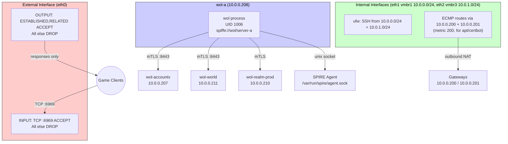

---

## 10. Data Model Overview

Logical data domains across the three API services.

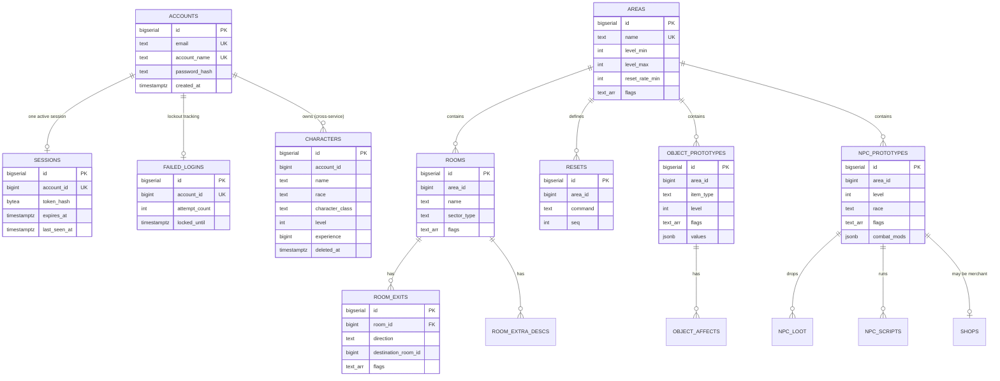

**Note:** `ACCOUNTS` and `CHARACTERS` are in separate databases on separate hosts. The `account_id` reference in `CHARACTERS` is a plain BIGINT with no foreign key constraint (cross-service boundary). Similarly, `area_id` in rooms/objects/NPCs/resets uses plain BIGINT references (future-proofed for domain splitting).

---

## 11. Firewall Rules Summary

Per-host firewall configuration across the infrastructure.

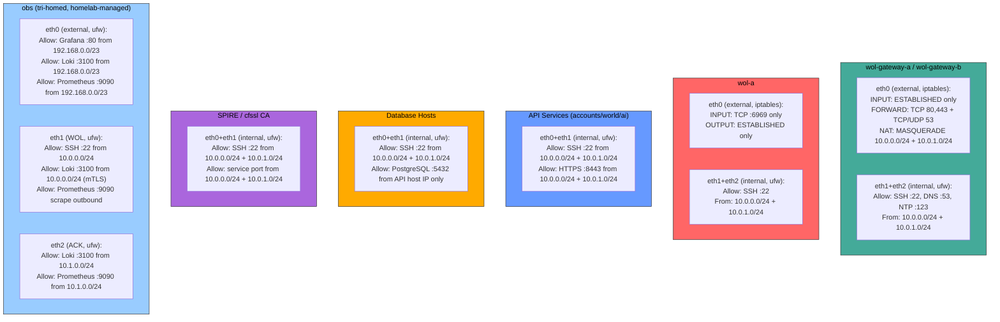

---

## 12. Observability Data Flow

How logs and metrics flow from services to the central observability stack.

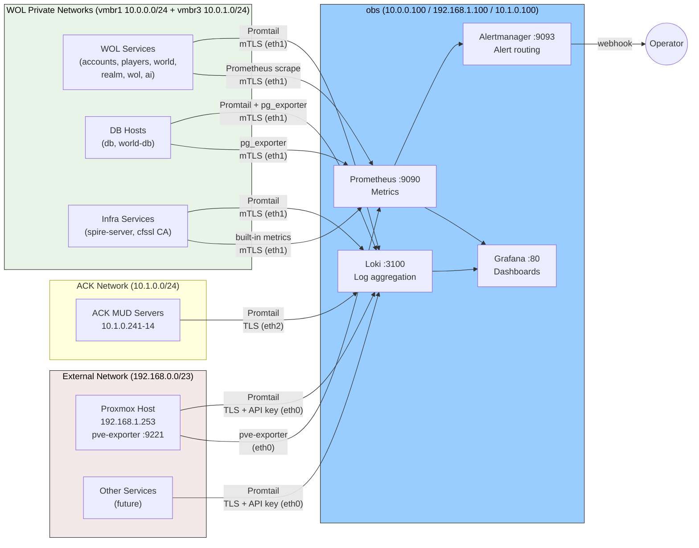

---

## 13. Certificate Renewal Lifecycle

How certificates are automatically renewed across the system.

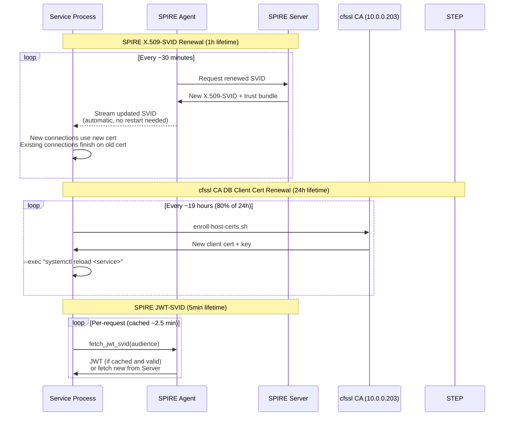

---

## 14. Authorization Matrix

Which services can call which, and what identity they present.

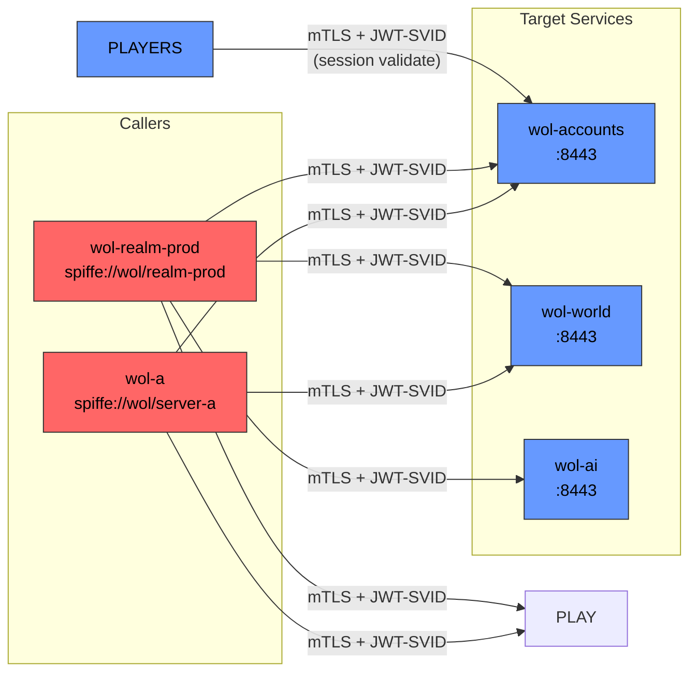


---

## Host IP Reference

**SPIFFE ID mapping:** SPIFFE IDs identify the workload role, not the hostname. For example, `spiffe://wol/server-a` is the identity of the wol process running on host `wol-a`. The full mapping:

| SPIFFE ID | Host | Workload |
|-----------|------|----------|
| `spiffe://wol/accounts` | wol-accounts | Accounts API |
| `spiffe://wol/world-prod` | wol-world-prod | World API (prod) |
| `spiffe://wol/world-test` | wol-world-test | World API (test) |
| `spiffe://wol/server-a` | wol-a | Connection interface |
| `spiffe://wol/realm-prod` | wol-realm-prod | Game engine (prod) |
| `spiffe://wol/realm-test` | wol-realm-test | Game engine (test) |
| `spiffe://wol/ai-prod` | wol-ai-prod | AI service (prod) |
| `spiffe://wol/ai-test` | wol-ai-test | AI service (test) |
| (none, infrastructure) | obs | Observability (no SPIRE Agent, uses cfssl CA certs) |

**Shared infrastructure (dual-bridge: vmbr1 + vmbr3):**

| vmbr1 IP | vmbr3 IP | Hostname | Role |
|----------|----------|----------|------|
| 10.0.0.200 | 10.0.1.200 | wol-gateway-a | NAT gateway, DNS, NTP |
| 10.0.0.201 | 10.0.1.201 | wol-gateway-b | NAT gateway, DNS, NTP (active-active) |
| 10.0.0.202 | 10.0.1.202 | spire-db | PostgreSQL (SPIRE) + Tang (NBDE) |
| 10.0.0.203 | 10.0.1.203 | cfssl CA | Private CA (DB certs) |
| 10.0.0.204 | 10.0.1.204 | spire-server | SPIRE Server (workload identity) |
| 10.0.0.205 | -- | provisioning | vTPM Provisioning CA |
| 10.0.0.206 | 10.0.1.206 | wol-accounts-db | PostgreSQL (wol-accounts) |
| 10.0.0.207 | 10.0.1.207 | wol-accounts | Accounts API (C#/.NET) |
| 10.0.0.208 | 10.0.1.208 | wol-a | Connection interface (.NET, also ext-homed) |
| 10.0.0.209 | 10.0.1.209 | wol-web | Web frontend: ackmud.com (.NET Kestrel) |
| 10.0.0.100 | -- | obs | Observability (Loki, Prometheus, Grafana; tri-homed, homelab) |
| 10.0.0.115 | -- | apt-cache | apt-cacher-ng package cache (tri-homed, homelab) |

**Prod environment (vmbr1, 10.0.0.0/24):**

| IP | Hostname | Role |
|----|----------|------|
| 10.0.0.210 | wol-realm-prod | Game engine (.NET, internal only) |
| 10.0.0.211 | wol-world-prod | World API (C#/.NET) |
| 10.0.0.213 | wol-world-db-prod | PostgreSQL (wol_world) |
| 10.0.0.212 | wol-ai-prod | AI service (C#/.NET) |

**Test environment (vmbr3, 10.0.1.0/24):**

| IP | Hostname | Role |
|----|----------|------|
| 10.0.1.215 | wol-realm-test | Game engine (.NET, internal only) |
| 10.0.1.216 | wol-world-test | World API (C#/.NET) |
| 10.0.1.218 | wol-world-db-test | PostgreSQL (wol_world) |
| 10.0.1.217 | wol-ai-test | AI service (C#/.NET) |
| 192.168.1.253 | (Proxmox host) | Hypervisor (pve-exporter + Promtail push to obs) |
